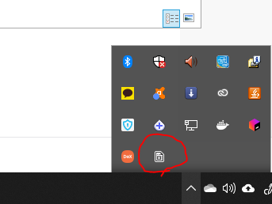

# FreeXanta 1.0.0.0

## PC Application 설치
* 프로그램의 설치는 설치가 제거된 상태에서 설치해 주십시오.
(이번 버전이 최초 릴리즈이지만 기존 개발자 릴리즈때 설치한 분은 설치 제거후 설치해주세요.)
* PC용 설치 파일을 다운로드 합니다.

* 파일의 압축을 풉니다.

* setup.exe를 실행합니다.

* 실행을 완료하면 FreeXantaPC가 바로 실행됩니다.
아래와 같이 방화벽에 대한 경고가 나오는데 허용을 해 주어야 안드로이드 앱과 통신이 가능합니다.

* 종료 후 나중에 다시 시작할 때는 Windows의 검색 창에 FreeXanta를 검색하여 실행하면 됩니다.
* 프로그램의 설치 삭제는 제어판의 프로그램 추가/제거에서 해 주세요.

## PC 프로그램의 실행.

* 프로그램을 실행하면 우하단 영역에 시스템 트레이에서 FreeXanta Application이 구동하고 있습니다.

* 트레이 메뉴는 다음과 같이 About, 서버시작, 서버 중지, 종료의 네 가지가 있습니다.

* About은 이 앱에 대한 간단한 설명을 포함하고 있습니다.

* 서버 시작은 서버를 개시합니다. 이미 개시된 상태인 경우에는 아무것도 하지 않습니다.
* 서버 중지는 서버를 중지합니다. 이미 중지된 상태인 경우에는 아무것도 하지 않습니다.

## 안드로이드 프로그램의 설치
* 안드로이드 설치 프로그램을 다운로드 하여 안드로이드 기기에 설치합니다.

## 안드로이드 프로그램의 실행
* 아래의 이미지에서 1은 서버(PC)의 주소를 변경하기 위한 버튼입니다.
* 2는 서버(PC)에 연결/연결해제 위한 버튼입니다.

* 다음 이미지는 1을 클릭했을 때의 이미지입니다.

* 다음 이미지는 2를 클릭하여 PC와 연결되었을 때 2의 아이콘이 변경된 화면입니다.

* PC와 연결되고나면
   * 버튼을 눌러 키를 PC로 전송할 수 있습니다.
   * 마우스 영역을 움직여서 PC의 마우스를 조작할 수 있습니다.
   * <, >를 이용하여 왼쪽 화살표, 오른쪽 화살표 키를 PC로 전송할 수 있습니다.
